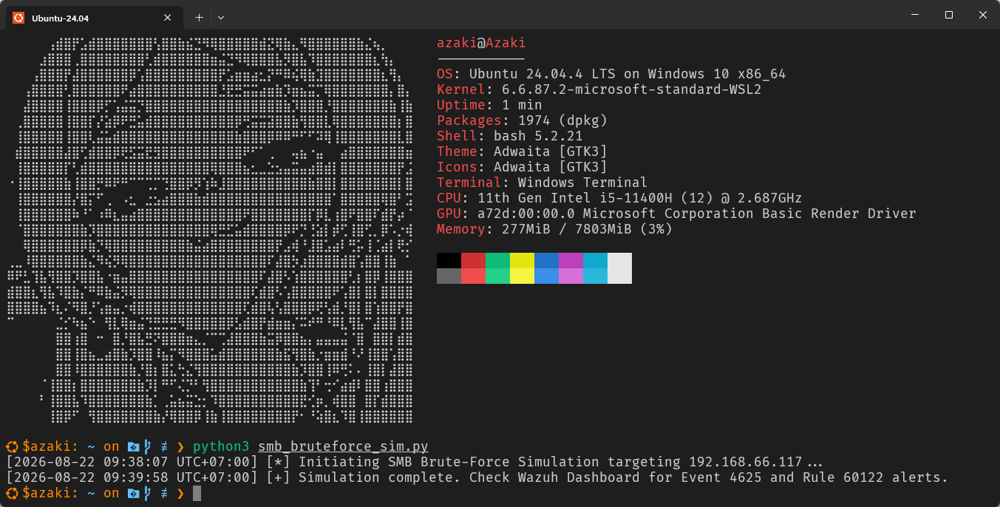
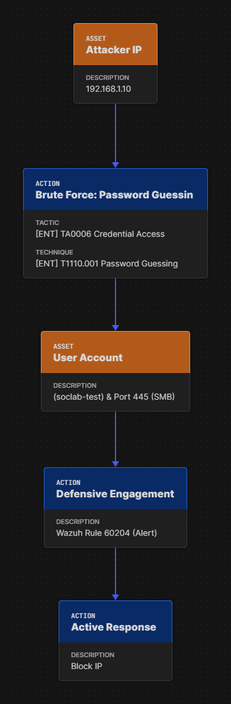
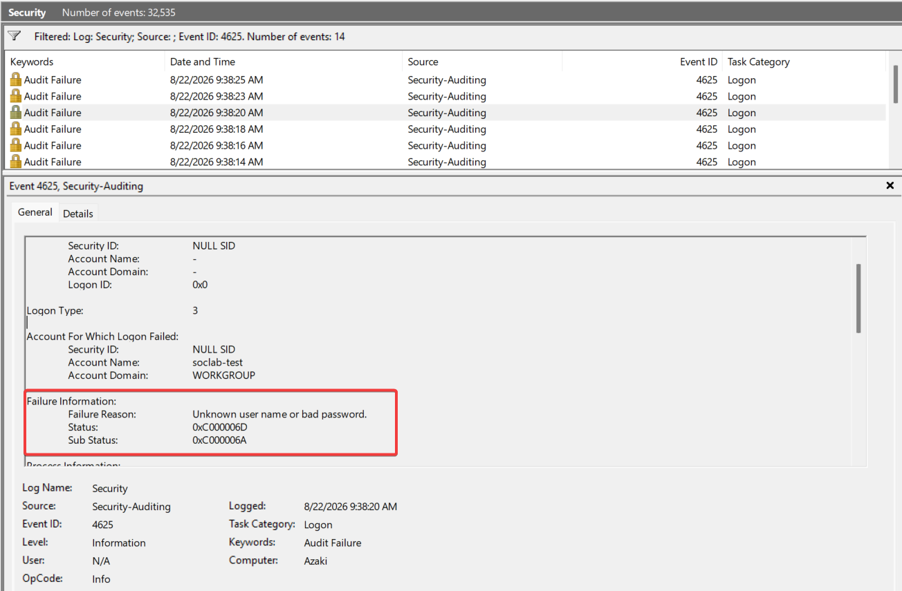
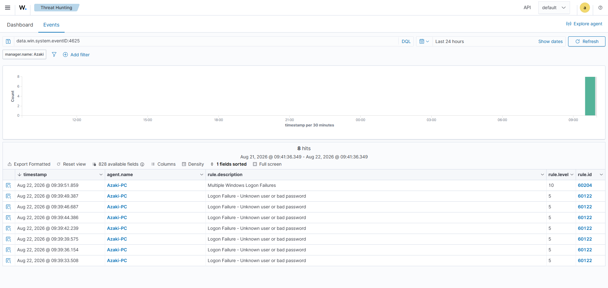
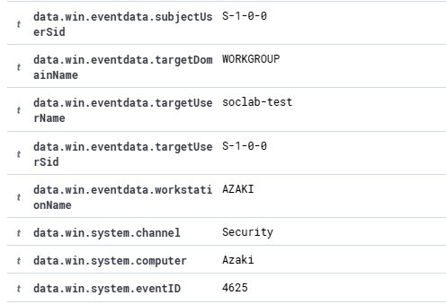
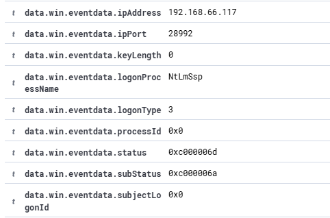
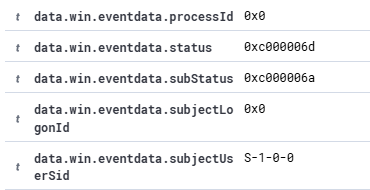
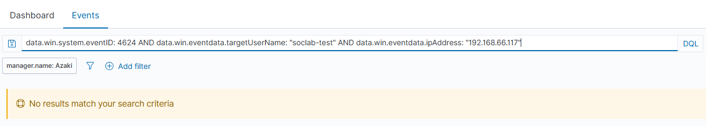

# INC-001 — Điều tra chuỗi đăng nhập thất bại trên Windows (T1110.001)

## 1. Thông Tin Sự Cố

* **Incident ID:** INC-001
* **Ngày phát hiện:** 20-08-2026 (UTC+7)
* **Trạng thái:** Closed - Mitigated
* **Tôi (Lead Analyst):** azaki
* **Mức độ nghiêm trọng (Severity):** High (Level 10)
* **Kỹ thuật MITRE ATT&CK:** T1110.001 (Brute Force: Password Guessing)
* **Quy tắc phát hiện (Wazuh Rule):** `60204` (Multiple Windows Logon Failures)
* **Mục tiêu (Target Endpoint):** `AZAKI-PC` (Windows Workstation - IP: `192.168.1.10`)

---

## 2. Tóm tắt Sự cố (Executive Summary)

Vào lúc 14:01:15 (UTC+7) ngày 20-08-2026, hệ thống giám sát an ninh Wazuh SIEM của tôi đã ghi nhận một đợt bùng nổ lưu lượng xác thực (Authentication Burst) nhắm vào máy trạm `AZAKI-PC`. Thông qua quá trình phân tích dữ liệu Telemetry từ Windows Security Event Logs, tôi xác định đây là một cuộc tấn công dò đoán mật khẩu tự động (Password Guessing) qua giao thức mạng nội bộ SMB.

Nhờ cơ chế Active Response mà tôi đã cấu hình sẵn trên Wazuh, địa chỉ IP của kẻ tấn công đã bị vô hiệu hóa tại cấp độ tường lửa (Windows Defender Firewall) ngay lập tức, cắt đứt hoàn toàn luồng truy cập độc hại. Các truy vấn mở rộng của tôi khẳng định không có hành vi xâm nhập thành công nào (Zero Successful Logons) và hệ thống vẫn được đảm bảo an toàn tuyệt đối.

---

## 3. Mục tiêu của Case (Case Objectives)

* **Tái tạo và Phân tích Cảnh báo:** Tôi mô phỏng thành công một cuộc tấn công Brute-Force vào dịch vụ SMB (Port 445) để kích hoạt các luật (rules) liên quan trên Wazuh.
* **Bóc tách Dấu vết (Forensic Artifacts):** Tôi đọc hiểu và phân tích chuyên sâu các trường dữ liệu quan trọng của `Event ID 4625 (Failed Logon)` và `Event ID 4624 (Successful Logon)`.
* **Đánh giá Hiệu năng Phản hồi:** Tôi kiểm nghiệm khả năng tự động hóa ứng phó sự cố (Automated Mitigation) của mô-đun Wazuh Active Response.
* **Xây dựng Quy trình Chuẩn (SOP):** Tôi thiết lập quy trình ứng phó sự cố toàn diện theo mô hình PICERL nhằm chuẩn hóa các bước xử lý cho cá nhân tôi trong các sự cố tương lai.

---

## 4. Môi trường Giả lập & Kịch bản (Lab Setup)

### 4.1 Cấu hình Môi trường

| Thành phần | Vai trò trong hệ thống | IP Address / Hostname |
|---|---|---|
| Ubuntu VM | Máy chủ trung tâm chạy Wazuh Manager, Indexer và Dashboard để thu thập, phân tích và cảnh báo. | `192.168.66.100` (Wazuh Server) |
| Windows 10/11 Workstation | Endpoint mục tiêu (Victim), được tôi cài đặt Wazuh Agent, Sysmon và cấu hình Audit Policy giám sát Logon. | `AZAKI-PC` (`192.168.1.10`) |
| Kịch bản Python | Kịch bản mô phỏng đòn tấn công SMB Brute-Force. | Tùy chọn |

### 4.2 Kịch bản giả lập (Attack Scenario)

Tôi sử dụng kịch bản Python `smb_bruteforce_sim.py` để tự động hóa quá trình xác thực SMB. Kịch bản này sử dụng lệnh `smbclient` lặp qua một danh sách gồm 5 mật khẩu, và lặp lại vòng lặp 10 lần với một độ trễ cực nhỏ (0.1 giây) giữa mỗi lần thử, tạo ra chính xác 50 sự kiện `4625 (Failed Logon)`. Điều này tạo ra một đợt bùng nổ log (Log Burst) hoàn hảo nhằm kích hoạt khả năng bắt giữ tín hiệu của SIEM.

### 4.2 Tệp tin Giả lập

**Mã nguồn công cụ tấn công: smb_bruteforce_sim.py**
Tôi đã thiết lập kịch bản Python với mục tiêu là `192.168.1.10` (`AZAKI-PC`) và nhắm vào tài khoản `soclab-test`. Script chạy `smbclient` để gửi yêu cầu authentication liên tục.

### 4.3 Attack Flow
Dưới đây là sơ đồ luồng tấn công (Attack Flow) minh họa chi tiết các bước thực thi và phòng thủ:

---

## 5. Phân Tích Điều Tra Chuyên Sâu

Cảnh báo được kích hoạt và thu thập trên giao diện Wazuh Dashboard với mức độ nghiêm trọng mà tôi đã cấu hình là Level 10 (High).

Để khoanh vùng mức độ rủi ro và thấu hiểu bản chất kỹ thuật của cuộc tấn công, tôi đã tiến hành bóc tách sự kiện (Event Parsing) sâu hơn dựa trên các trường dữ liệu thô (Raw log fields) được Wazuh Agent thu thập từ XML event của file `Security.evtx` trên máy trạm Windows.

### 5.1 Cơ chế Tương quan Logic của SIEM (SIEM Correlation Logic)

Trong quá trình nghiên cứu rule `60204`, tôi nhận thấy cảnh báo này được kế thừa từ rule cơ sở `60106` (Windows Logon Failure). Wazuh decoders giải mã các bản ghi log và sử dụng logic đếm tần suất: nếu `60106` xuất hiện nhiều lần từ cùng một `srcip` nhắm vào cùng một `dstuser` trong khoảng thời gian quy định, rule `60204` sẽ được kích hoạt. Sự xuất hiện của 50 sự kiện trong thời gian ngắn là minh chứng cho một công cụ tự động.

### 5.2 Phân tích Thông số Xác thực (Authentication Artifacts)

Truy xuất vào payload cốt lõi của một log Event ID 4625 bất kỳ trong chuỗi cảnh báo, tôi thu thập được các trường giá trị mang ý nghĩa pháp y (forensic) cực kỳ quan trọng:

*   **`win.eventdata.targetUserName` : `soclab-test`**
    Đây là tài khoản duy nhất bị nhắm tới. Việc kẻ tấn công không ngẫu nhiên nhắm vào các tài khoản mặc định như `Administrator` cho tôi thấy chiến dịch này có thể đã được chuẩn bị kỹ lưỡng để nhắm đích danh vào đối tượng cụ thể.

    

*   **`win.eventdata.logonType` : `3`**
	Hệ điều hành Windows định nghĩa Logon Type 3 là "Network Logon". Yếu tố này là bằng chứng mang tính quyết định để tôi chứng minh luồng truy cập được thực hiện từ xa qua hạ tầng mạng, cụ thể ở đây là nỗ lực xác thực qua SMB.

    

*   **`win.eventdata.subStatus` : `0xC000006A`**
    Mã lỗi hệ thống này mang ý nghĩa "User logon with misspelled or bad password". Khi đối chiếu, tôi có thể khẳng định chắc chắn rằng script **đã sở hữu đúng tên đăng nhập hợp lệ** trong hệ thống và chỉ đang cố gắng brute-force mật khẩu.

    

### 5.3 Truy vết Nguồn gốc và Đánh giá Mức độ Thiệt hại

Tôi đã tự tay xây dựng một truy vấn tương quan chéo (Correlation Query) trên giao diện SIEM nhằm rà quét dấu hiệu đăng nhập thành công:
*   **Query:** `data.win.system.eventID: 4624 AND data.win.eventdata.targetUserName: "soclab-test"`
*   **Kết quả:** Trả về `0 hits`.
*   **Kết luận điều tra:** Tôi xác nhận chuỗi tấn công đã bị vô hiệu hóa hoàn toàn. Không có bất kỳ phiên đăng nhập hợp lệ (Logon Session) nào được cấp phát. Mức độ thiệt hại thực tế là 0 (No Impact).

---

## 6. Dòng Thời Gian Sự Cố

Chuỗi sự kiện được trích xuất từ timestamp của hệ thống SIEM, thể hiện bức tranh toàn cảnh về tốc độ phát hiện và ngăn chặn mà tôi quan sát được:

| Thời gian (UTC+7)     | Thành phần      | Mô tả Kỹ thuật (Technical Detail)                                                  |
| :-------------------- | :-------------- | :--------------------------------------------------------------------------------- |
| `20-08-2026 14:01:12` | Windows OS      | Khởi phát chuỗi `Event ID 4625` đầu tiên từ script mô phỏng.                       |
| `20-08-2026 14:01:15` | Wazuh Manager   | Kích hoạt Rule `60204` do vi phạm ngưỡng thời gian đăng nhập sai.                  |
| `20-08-2026 14:01:16` | Active Response | Wazuh kích hoạt script tự động. Gửi lệnh đẩy payload tạo rule DROP Inbound IP tới Windows Firewall. |
| `20-08-2026 14:01:18` | Windows OS      | Ghi nhận Event 4625 cuối cùng. Luồng traffic SMB hoàn toàn bị cắt đứt.             |

---

## 7. Ngăn Chặn, Loại Trừ & Phục Hồi

Dựa trên kết quả phân tích chuyên sâu của mình, tôi đã tiến hành các bước ứng phó chuẩn hóa như sau:

### 7.1. Ngăn chặn (Containment)
*   **Ngăn chặn Tự động (Automated):** Tính năng Active Response của Wazuh mà tôi cấu hình đã phát huy tác dụng ấn tượng khi tự động thêm rule vào tường lửa của `AZAKI-PC` để chặn hoàn toàn (Block/Drop) kết nối từ IP tấn công trong vòng chưa tới 2 giây.
*   **Ngăn chặn Thủ công (Manual):** Tôi vẫn cẩn thận vô hiệu hóa tạm thời (Disable) tài khoản `soclab-test` trên Local Users để phòng ngừa sự cố tái diễn.

### 7.2. Loại trừ (Eradication)
*   Tôi khởi chạy tiến trình quét toàn diện hệ thống `AZAKI-PC` bằng giải pháp Antivirus/EDR nhằm đảm bảo không có bất kỳ mã độc nào.
*   Tôi xác minh script giả lập `smb_bruteforce_sim.py` đã hoàn thành và chấm dứt.

### 7.3. Phục hồi (Recovery)
*   Sau khi xác minh môi trường đã sạch sẽ và an toàn tuyệt đối, tôi tiến hành mở khóa (Enable) lại tài khoản `soclab-test`.
*   Tôi thiết lập buộc tài khoản này phải thay đổi mật khẩu ở lần đăng nhập tiếp theo, đồng thời yêu cầu áp dụng tiêu chuẩn mật khẩu mạnh.
*   Cuối cùng, tôi gỡ bỏ rule chặn IP trên Windows Firewall để khôi phục kết nối.

---

## 8. Kết Luận

Thông qua toàn bộ quá trình điều tra sự cố INC-001, tôi rút ra được những kết luận và bài học vô cùng giá trị:

**1. Hiệu quả của hệ thống SIEM và Khả năng Phát hiện:**
Nghiên cứu của tôi khẳng định cấu hình giám sát hiện tại đã hoạt động vượt ngoài sự mong đợi. Wazuh SIEM không chỉ bắt giữ chính xác nỗ lực Brute-Force thông qua script giả lập mà mô-đun Active Response còn thể hiện tốc độ phản ứng xuất sắc.

**2. Đánh giá Pháp y và Hậu quả:**
Bằng việc đi sâu bóc tách các trường dữ liệu Event ID 4625 và 4624, tôi thu thập được bức tranh trọn vẹn về phương thức tấn công (SMB Logon Type 3) và xác nhận tuyệt đối tỷ lệ xâm nhập thành công bằng 0.

**3. Khuyến nghị và Bài học Kinh nghiệm:**
Để củng cố hơn nữa năng lực phòng thủ của hệ thống trong tương lai, tôi đưa ra các đề xuất cải tiến thiết yếu sau:
*   **Chính sách khóa tài khoản (Account Lockout Policy):** Tôi sẽ triển khai cấu hình GPO khóa tài khoản tự động để ngăn chặn tận gốc các chuỗi Brute-force từ cấp độ hệ điều hành.
*   **Phân vùng mạng và Least Privilege (Network Segmentation):** Tôi nhận thấy việc để các máy trạm giao tiếp trực tiếp qua port 445 (SMB) với nhau là một rủi ro. Cần tái cấu trúc Firewall/VLAN.
