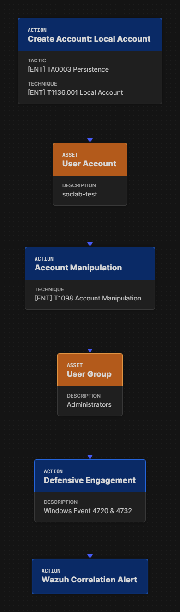
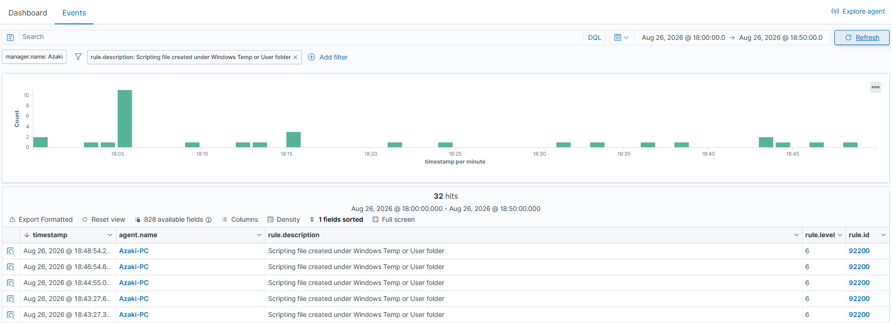
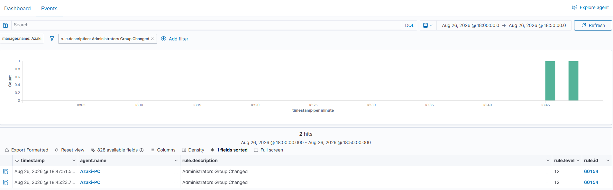

# INC-003 — Điều Tra Leo Thang Đặc Quyền và Thiết Lập Cửa Hậu (Privilege Escalation & Persistence)

## 1. Thông Tin Sự Cố 

* **Incident ID:** INC-003
* **Ngày phát hiện:** 26-08-2026
* **Trạng thái:** Closed - Mitigated
* **Người xử lý:** Tôi (azaki)
* **Mức độ nghiêm trọng (Severity):** High 
* **Quy tắc phát hiện:** `60109` (User account enabled or created), `60144` (Security Enabled Local Group Member Added)
* **Khung MITRE ATT&CK:** 
  * Tactic: Persistence (TA0003), Privilege Escalation (TA0004)
  * Technique: Account Manipulation (T1098), Create Account: Local Account (T1136.001)

## 2. Tóm tắt sự cố (Executive Summary)
Qua quy trình giám sát liên tục, hệ thống Wazuh SIEM của tôi đã ghi nhận một chuỗi sự kiện bất thường trên Agent `Azaki-PC` vào ngày 26/08/2026. Kịch bản giả lập đã thực thi một PowerShell script độc hại. Script này tiến hành tạo một tài khoản cục bộ mới có tên `soclab-test` và ngay lập tức đưa tài khoản này vào nhóm đặc quyền tối cao `Administrators`. Đây là dấu hiệu điển hình của hành vi thiết lập cửa hậu (Backdoor) nhằm duy trì quyền kiểm soát hệ thống vĩnh viễn (Persistence). Tôi đã triển khai ngay lập tức các biện pháp cách ly, xóa tài khoản bất hợp pháp để bảo vệ hệ thống.

---

## 3. Mục tiêu của Case (Case Objectives)
Mô hình lab này được tôi xây dựng nhằm mục đích:
1. **Nhận diện và Phân tích:** Hiểu rõ cơ chế và các sự kiện sinh ra khi một PowerShell script tạo tài khoản cục bộ mới (Event 4720) và cấp đặc quyền quản trị (Event 4732).
2. **Phân tích Timeline sự cố:** Theo dõi diễn biến theo trình tự thời gian để xâu chuỗi hành động của script.
3. **Mô hình hóa Mối đe dọa:** Xác định được nguồn gốc tiến trình thực thi và phân tích mã SID liên kết.
4. **Phản ứng Sự cố (Incident Response):** Áp dụng đúng quy trình PICERL để loại bỏ cửa hậu, ngăn chặn rủi ro và tinh chỉnh hệ thống giám sát.

---

## 4. Môi trường Giả lập & Kịch bản (Lab Setup)

### 4.1 Cấu hình Môi trường

| Thành phần | Vai trò trong hệ thống | IP Address / Hostname |
|---|---|---|
| Ubuntu VM | Máy chủ trung tâm chạy Wazuh Manager, Indexer và Dashboard để thu thập, phân tích và cảnh báo. | `192.168.66.100` (Wazuh Server) |
| Windows 10/11 Workstation | Endpoint mục tiêu (Victim), được tôi cài đặt Wazuh Agent, Sysmon và cấu hình Audit Policy giám sát Logon. | `Azaki-PC` |

### 4.2 Tệp tin Giả lập
**Tên tệp:** `account_privilege_sim.ps1`
### 4.3 Kịch bản giả lập
Tôi đã chạy một script PowerShell giả lập hành vi kẻ tấn công. Script này tiến hành khởi tạo một tài khoản mới (`soclab-test`) với mật khẩu được định nghĩa sẵn, sau đó lập tức nâng quyền tài khoản này lên cấp cao nhất (Administrators Group) nhằm mục đích giả lập duy trì truy cập (Persistence).

### 4.4 Attack Flow
Dưới đây là sơ đồ luồng tấn công (Attack Flow) minh họa chi tiết các bước thực thi và phòng thủ:

---

## 5. Phân Tích Điều Tra Chuyên Sâu

Trong quá trình trực hệ thống, tôi đã nhận được tín hiệu cảnh báo từ Wazuh SIEM. Để làm rõ bản chất của sự cố này, tôi tiến hành mổ xẻ dữ liệu nhằm tái tạo lại toàn bộ vòng đời thực thi trên Agent `Azaki-PC`.

### Bước 5.1: Phân tích Hành Vi Thiết Lập Cửa Hậu (Backdoor Setup)
* Hệ thống ghi nhận **Rule 60109** (`User account enabled or created`). Một tài khoản cục bộ mới `soclab-test` đã được tạo trên hệ thống thông qua PowerShell.

* Ngay sau đó, các thuộc tính của tài khoản này được thiết lập thông qua **Rule 60110** (`User account changed`). Điều này xác nhận rằng mật khẩu và các thông số khác cho tài khoản backdoor đã được gán hoàn tất.

### Bước 5.2: Phân tích Hành Vi Leo Thang Đặc Quyền (Privilege Escalation)
* Quan trọng nhất, chỉ vài giây sau khi tạo tài khoản, quy tắc **60144** (`Security Enabled Local Group Member Added`) kích hoạt. Cảnh báo này cho thấy tài khoản vừa tạo đã được đưa vào nhóm quyền cao nhất `Administrators`. Bằng cách ánh xạ chéo (Cross-Referencing) trường `TargetSid` của user được tạo mới và `MemberSid` của event thêm vào nhóm, tôi khẳng định chắc chắn 100% về mặt pháp y: Tài khoản mới sinh ra đã lập tức được bơm thẳng vào nhóm Administrators.

### Bước 5.3: Đánh giá Phạm vi Ảnh hưởng
Tôi đã rà soát các phiên đăng nhập Logon (Event 4624) để xem tài khoản backdoor đã được sử dụng hay chưa. Không có bất kỳ sự kiện đăng nhập nào từ tài khoản `soclab-test`. Tôi kết luận rằng hành vi đã được phát hiện và ngăn chặn ngay ở giai đoạn thiết lập.

---

## 6. Dòng Thời Gian Sự Cố

Dựa trên dữ liệu thu thập được, tôi đã trích xuất chuỗi sự kiện theo trình tự thời gian như sau:

| Thời gian (T0) | Thành phần    | Mô tả Kỹ thuật (Technical Detail)                                                                                                                        |
| :------------- | :------------ | :------------------------------------------------------------------------------------------------------------------------------------------------------- |
| `T0`           | Wazuh Manager | **Rule 60109 (level 8):** `User account enabled or created`. Script thực thi lệnh tạo tài khoản người dùng mới `soclab-test`.                            |
| T0 + 1s        | Wazuh Manager | **Rule 60110 (level 8):** `User account changed`. Mật khẩu và thông tin của tài khoản `soclab-test` được thiết lập.                                      |
| T0 + 4s        | Wazuh Manager | **Rule 60144 (level 8):** `Security Enabled Local Group Member Added`. Tài khoản `soclab-test` được chèn vào nhóm đặc quyền `Administrators` thành công. |

---

## 7. Ngăn Chặn, Loại Trừ & Phục Hồi

Tuân thủ quy trình ứng phó sự cố tiêu chuẩn, tôi đã thực hiện:

### 7.1 Ngăn Chặn (Containment)
* **Cô lập máy trạm (Network Isolation):** Tôi lập tức cách ly Agent `Azaki-PC` khỏi mạng nội bộ để ngăn chặn kẻ tấn công lợi dụng tài khoản backdoor.
* **Đóng băng phiên bản:** Tôi tiến hành chụp bộ nhớ và cấu hình máy ảo để phục vụ công tác phân tích.

### 7.2 Loại trừ (Eradication)
1. **Gỡ quyền quản trị và Hủy tài khoản xâm nhập:** Tôi dùng PowerShell để xóa user `soclab-test` ra khỏi nhóm `Administrators` và xóa hẳn tài khoản này khỏi hệ thống.
2. **Loại bỏ Script độc hại:** Quét và xóa file script `account_privilege_sim.ps1` khỏi hệ thống.

### 7.3 Phục hồi & Khuyến nghị (Recovery & Tuning)
1. **Tinh chỉnh Log giám sát (Log Tuning):** Tôi sẽ tiến hành tích hợp chuỗi tương quan SID giữa Event 4720 và 4732 vào trong một Custom Rule của Wazuh để tăng mức độ tự động phát hiện cho loại hình tấn công này.

---

## 8. Kết Luận

Thông qua cuộc điều tra pháp y chuyên sâu này, tôi đã xác nhận thành công một nỗ lực leo thang đặc quyền và thiết lập cửa hậu từ script giả lập. Quá trình bắt đầu bằng việc tạo tài khoản mới (Rule 60109) và ngay lập tức cấp quyền quản trị (Rule 60144). Việc theo dấu bằng SID thay vì tên tài khoản đã chứng minh hiệu quả trong việc tạo ra chuỗi bằng chứng không thể chối cãi. Wazuh SIEM của tôi đã hoàn thành xuất sắc vai trò ghi nhận sự kiện, giúp tôi xử lý và triệt tiêu tài khoản backdoor ngay lập tức.