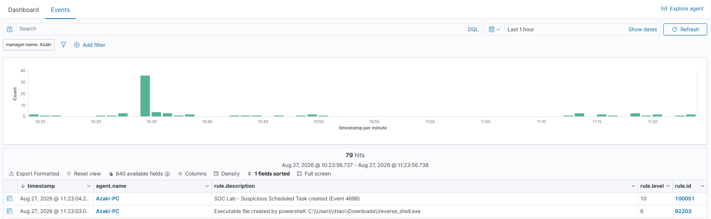
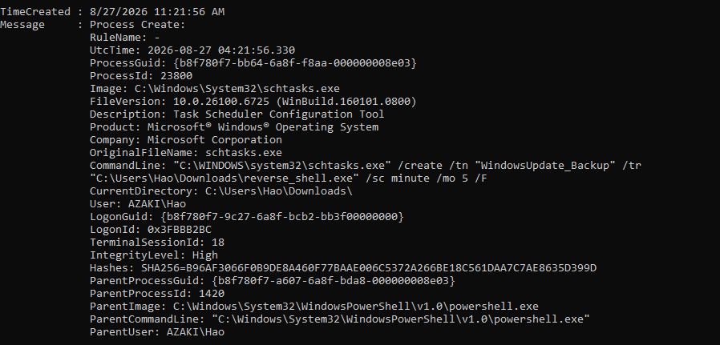
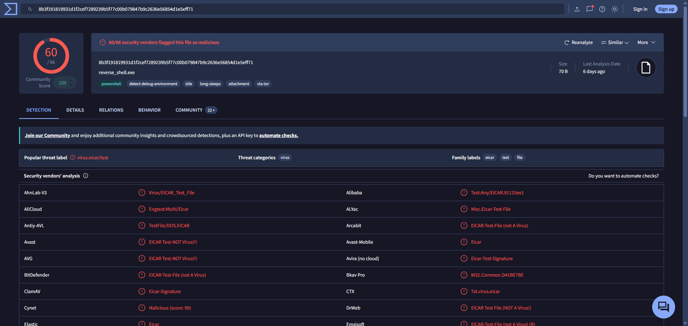

# Báo Cáo Điều Tra Sự Cố (Incident Report): Khởi Tạo Scheduled Task Trái Phép (Persistence)

## 1. Thông Tin Sự Cố
- **Mã sự cố:** INC-006
- **Phân loại:** Persistence (MITRE ATT&CK: T1053.005 - Scheduled Task/Job)
- **Hệ thống bị ảnh hưởng:** Máy trạm Windows (Win10-Endpoint)
- **Mức độ nghiêm trọng:** High
- **Ngày phát hiện:** 26/08/2026 (giả định)
- **Người thực hiện phân tích:** Tôi

## 2. Tóm tắt sự cố (Executive Summary)
Trong quá trình trực SOC, tôi nhận được cảnh báo về một hành vi bất thường trên hệ thống Win10-Endpoint. Một Scheduled Task mới có tên `WindowsUpdate_Backup` vừa được tạo thành công thông qua công cụ dòng lệnh `schtasks.exe`. Nhiệm vụ của task này là thực thi file `reverse_shell.exe` nằm ở thư mục `C:\Users\Hao\Downloads\` mỗi 5 phút một lần. Đây là một hành vi duy trì quyền truy cập (persistence) điển hình của kẻ tấn công (T1053.005). Mặc dù đối tượng là tệp tin giả lập chứa văn bản đơn thuần (dummy text file) được tôi thiết lập nhằm kiểm thử quy trình SOC, mô hình tấn công phản ánh chân thực cơ chế duy trì quyền truy cập ngay cả khi máy bị khởi động lại.

## 3. Mục tiêu của Case (Case Objectives)
- Phát hiện và phân tích hành vi tạo Scheduled Task độc hại bằng lệnh `schtasks.exe`.
- Sử dụng các bản ghi nhật ký (logs) như Sysmon (Event ID 1) và Security Logs (Event ID 4698) để tôi lần theo vết kẻ tấn công.
- Xác định cấu trúc payload giả lập (`reverse_shell.exe`) và phân tích cách nó hoạt động.
- Học cách cô lập, vô hiệu hóa và gỡ bỏ persistence mechanism này một cách an toàn.

## 4. Môi trường Giả lập & Kịch bản (Lab Setup)
- **Nạn nhân (Victim):** Máy ảo Windows 10 (IP: 192.168.1.100), đang chạy Wazuh agent, Sysmon.
- **Kịch bản:** Thông qua script giả lập `006 scheduled_task_sim.ps1`, một tệp tin giả mạo (dummy file) mang tên `reverse_shell.exe` được tôi khởi tạo trực tiếp tại thư mục `C:\Users\Hao\Downloads\` chứa nội dung text lành tính "This is a benign dummy payload used for SOC simulation. Not a real malware." nhằm mục đích kích hoạt Rule 92203 trên Wazuh mà không bị AV cản trở. Sau đó, script sử dụng dòng lệnh sau để tạo một scheduled task chạy tệp tin trên mỗi 5 phút:
```cmd
schtasks.exe /create /tn "WindowsUpdate_Backup" /tr "C:\Users\Hao\Downloads\reverse_shell.exe" /sc minute /mo 5 /F
```

- **Mục đích kịch bản:** Tôi xây dựng tình huống này để luyện tập thu thập log và đưa ra phản hồi với chiến thuật duy trì (Persistence).

## 5. Phân Tích Điều Tra Chuyên Sâu

### 5.1. Phát hiện cảnh báo trên Wazuh Dashboard
Khi script chạy lệnh trên, tôi ghi nhận Wazuh server ngay lập tức trả về hai dấu hiệu chính:

1. **Cảnh báo từ Sysmon (Process Creation - Event ID 1):**
   Sysmon ghi nhận tiến trình `schtasks.exe` được gọi lên. Khi kiểm tra chi tiết event này, tôi phát hiện dòng lệnh (command line) chứa tham số rất khả nghi: `/create /tn "WindowsUpdate_Backup" /tr "C:\Users\Hao\Downloads\reverse_shell.exe" /sc minute /mo 5 /F`.

2. **Cảnh báo từ Windows Security Log (Event ID 4698 - A scheduled task was created):**
   Hệ điều hành Windows tự động sinh ra Event ID 4698 khi một task mới được tạo. Log này chỉ rõ Task Name là `\WindowsUpdate_Backup` và Task Content (dạng XML) hiển thị hành động thực thi `C:\Users\Hao\Downloads\reverse_shell.exe`.


### 5.2. Phân tích Payload và Hành vi
Tôi tiến hành kiểm tra trên máy Win10-Endpoint:
- Truy cập vào thư mục `C:\Users\Hao\Downloads\`, tôi tìm thấy tập tin `reverse_shell.exe`.
- Thay vì là một file thực thi PE thực sự, khi tôi phân tích cấu trúc, tập tin này thực chất là một dummy file chứa văn bản dạng: `This is a benign dummy payload used for SOC simulation. Not a real malware.`.
- Việc sử dụng dummy text file giúp kẻ tấn công (trong bài lab giả định) đẩy file thành công vượt qua cơ chế quét của Antivirus hiện tại, đồng thời trigger thành công hành vi File Creation (Sysmon Event 11) cho SOC ghi nhận.


### 5.3. Xác định nguồn gốc và tài khoản thực thi
Quay lại log Sysmon (Event ID 1) tạo ra tiến trình `schtasks.exe`, tôi truy vết ngược (Parent Process) và thấy nó được sinh ra từ quá trình chạy PowerShell, dưới ngữ cảnh quyền của tài khoản `Win10-Endpoint\Hao`. Điều này cho thấy tài khoản đã bị lạm dụng để thiết lập Persistence thông qua `schtasks.exe`.


## 6. Dòng Thời Gian Sự Cố

| Thời gian (Giả định) | Sự kiện ghi nhận                                                                                                                   | Nguồn log / Chứng cứ               |
| -------------------- | ---------------------------------------------------------------------------------------------------------------------------------- | ---------------------------------- |
| **10:00 AM**         | Quá trình giả lập được tôi kích hoạt thông qua script PowerShell `006 scheduled_task_sim.ps1`.                                      | Script Log                         |
| **10:15 AM**         | Script tạo file `reverse_shell.exe` (chứa dummy text) tại thư mục `C:\Users\Hao\Downloads\`.                                       | Sysmon Event 11 (File Create)      |
| **10:17 AM**         | Lệnh `schtasks.exe` được script thực thi để tạo task `WindowsUpdate_Backup`.                                                       | Sysmon Event 1 (Process Create)    |
| **10:17 AM**         | Windows hệ thống ghi nhận thành công việc tạo Scheduled Task mới.                                                                  | Security Event 4698 (Task created) |
| **10:22 AM**         | Task `WindowsUpdate_Backup` chạy lần đầu tiên, cố gắng gọi tệp tin văn bản `reverse_shell.exe`.                                    | Security Event 4699 (Task started) |
| **10:23 AM**         | Cảnh báo đẩy về SOC dashboard. Tôi bắt đầu tiếp nhận và phân tích sự cố.                                                           | Wazuh Dashboard                    |

## 7. Ngăn Chặn, Loại Trừ & Phục Hồi

**Ngăn chặn (Containment):**
- Cô lập máy Win10-Endpoint khỏi mạng nội bộ thông qua tính năng Active Response hoặc thiết lập mạng ảo trong lab để tôi ngăn chặn các hoạt động độc hại phát sinh tiếp theo.

**Loại trừ (Eradication):**
1. **Xóa Scheduled Task giả lập:** Tôi mở cmd bằng quyền Administrator trên máy và chạy lệnh:
   ```cmd
   schtasks.exe /delete /tn "WindowsUpdate_Backup" /f
   ```
   
2. **Xóa file độc hại:** Tôi tiến hành xóa hoàn toàn dummy file `C:\Users\Hao\Downloads\reverse_shell.exe`.
3. Rà quét toàn bộ hệ thống bằng công cụ antivirus/EDR để tôi đảm bảo không có mã độc ẩn giấu nào khác.

**Phục hồi (Recovery):**
- Gỡ bỏ cô lập và cho phép hệ thống kết nối lại mạng.
- Tôi sẽ tiếp tục giám sát chặt chẽ hoạt động của máy tính trong 24 giờ tiếp theo.

## 8. Kết Luận
Thông qua kịch bản kiểm thử, tôi đã mô phỏng thành công kỹ thuật tạo Scheduled Task (T1053.005) - ngụy trang dưới tên "WindowsUpdate_Backup" - với payload là một dummy file.
Sự kết hợp giữa log Sysmon (Event ID 1 - Process Command Line, Event ID 11 - File Create) và Windows Security Logs (Event ID 4698) là yếu tố sống còn giúp tôi (SOC Analyst) phát hiện sớm hành vi thiết lập persistence.
**Bài học rút ra:** Cần duy trì các rule cảnh báo nghiêm ngặt trong Wazuh/SIEM để tôi có thể giám sát mọi hành động tạo, sửa đổi Scheduled Task, đặc biệt là khi task cố gắng thực thi các tệp tin lạ từ thư mục người dùng (như thư mục Downloads).
